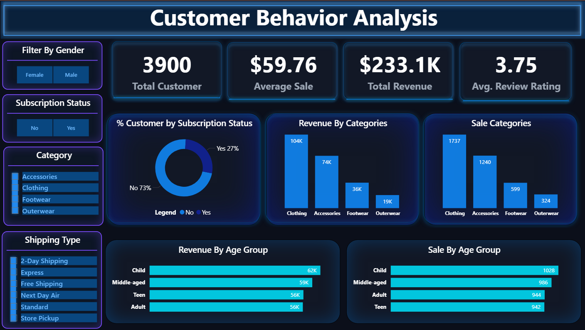

# 📊 Customer Behavior Analysis Dashboard

<p align="center">
  
</p>

---

## 🚀 Project Overview

This project focuses on analyzing customer purchasing behavior using an interactive Power BI dashboard.
It provides insights into customer demographics, product preferences, and subscription patterns.

---

## 🛠 Tools & Technologies


---

## 📈 Key Insights

* 👕 Clothing is the most purchased category
* 👥 Majority customers are **non-subscribed (73%)**
* 🧑 Adults generate the highest revenue
* 💰 Average purchase value is around **$59.76**
* ⭐ Customer rating average is **3.75**

---

## 📊 Dashboard Features

* Interactive slicers (Category, Gender, Subscription)
* KPI cards (Total Customers, Avg Sale, Rating)
* Category-wise sales analysis
* Age group distribution
* Subscription insights

---

## 🧠 SQL Analysis Sample

```sql
SELECT item_purchased,
ROUND(100 * SUM(CASE WHEN discount_applied = 'YES' THEN 1 ELSE 0 END) / COUNT(*), 2) AS discount_rate
FROM customer
GROUP BY item_purchased
ORDER BY discount_rate DESC
LIMIT 5;
```

---

## 📂 Dataset

Customer transaction dataset including:

* Demographics (Age, Gender)
* Purchase history
* Subscription status
* Product categories

---

## 🎯 Project Type


---

## 💡 What You Will Learn


* Data visualization best practices
* Dashboard UI/UX design (Neon Theme)
* Customer segmentation techniques
* SQL-based data analysis
> And Also
* Virtual environment create for python in VS Code
* Jupyter Notebook to Mysql Database Connections
* MySql Database to PowerBi Connection Via ODBC
> You can  get touch  real industry level excperience when you open the business problem file.

---

## 🔗 Author

**Khondoker Jahidul Islam**

---

## ⭐ Feedback

If you like this project, feel free to ⭐ the repo and share your feedback!
